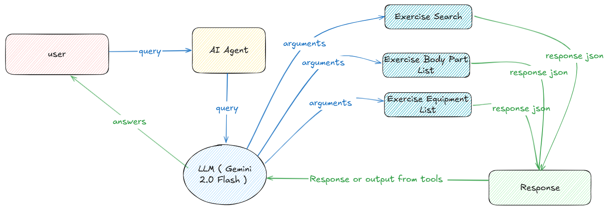

# Fitness-Coordinator-AI-Agent

An intelligent fitness assistant that creates personalized workout programs using AI and exercise science principles.

## Overview

This project implements an AI-powered fitness consultant that analyzes user goals and creates comprehensive, evidence-based exercise programs. The agent accesses the ExerciseDB API to provide tailored recommendations with detailed form instructions, appropriate equipment suggestions, and structured progression plans.

## Features

- **Goal Analysis**: Interprets specific fitness objectives including muscle building, fat loss, performance enhancement, and health improvements
- **Exercise Selection**: Recommends optimal exercises based on scientific efficacy for targeted muscle groups
- **Equipment Assessment**: Suggests appropriate equipment from various categories (free weights, machines, bodyweight)
- **Program Structure**: Designs training splits with appropriate volume, intensity, and periodization
- **Form Guidance**: Provides detailed instructions with visual demonstrations
- **Progression Planning**: Includes specific metrics to track and strategies for increasing difficulty

## Tech Stack

- Python
- smolagents and litellm for AI agent implementation
- Gemini 2.0 Flash model for natural language processing
- ExerciseDB API from RapidAPI for exercise data

## Use Cases

- Personal trainers seeking AI assistance for client program design
- Fitness enthusiasts wanting evidence-based workout recommendations
- Gym owners looking to enhance member services with AI technology
- Researchers exploring AI applications in exercise prescription

## Getting Started

1. Install required packages: `pip install smolagents -U litellm`
2. Set up API keys for LiteLLM and ExerciseDB
3. Run the notebook cells to initialize the agent
4. Input your fitness goals to receive personalized recommendations

## Future Development

- Integration with nutrition planning capabilities
- Mobile app development for on-the-go workout guidance
- Progress tracking and adaptive program adjustment
- Community features for sharing and comparing workout plans
